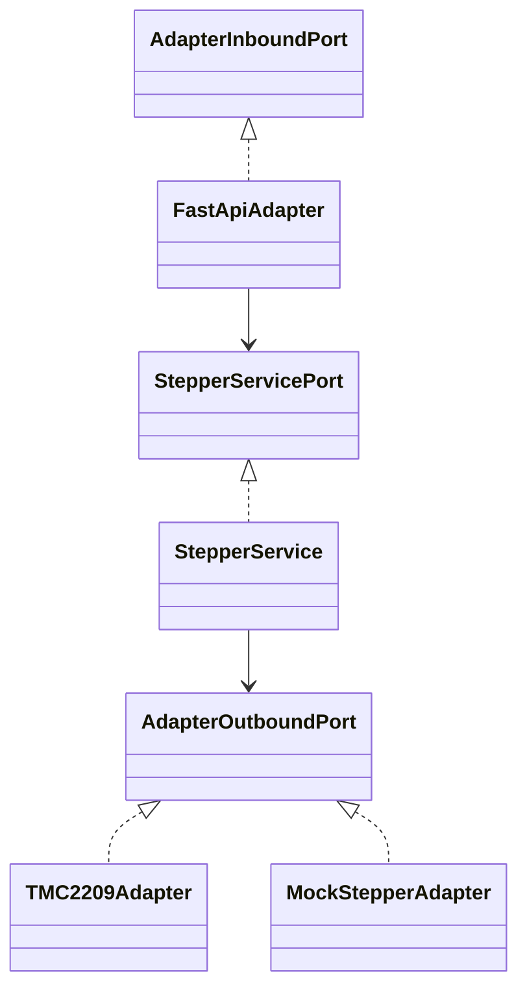

# Stepper Microservice Technical README

This README is a technical knowledge-transfer document for the current `stepper_microservice` codebase. It is based on repository inspection of the Python source, configuration files, and runtime environment.

## Project Overview

This project implements a low-latency raw stepper motor controller microservice. It exposes a FastAPI server that accepts motor control commands (e.g., rotate, steps, stop) and stream commands, processes them via an application service layer, and triggers hardware movements via a configured outbound adapter (either a mocked adapter or a real TMC2209 driver running on a Raspberry Pi via GPIO).

The code is organized around a ports-and-adapters, or hexagonal, architecture:

- **Inbound adapter**: FastAPI HTTP API in `infrastructure/inbound/http/fastapi_adapter.py`.
- **Application service**: orchestration layer in `application/services/service.py`.
- **Outbound adapters**:
  - Hardware `TMC2209` engine in `infrastructure/outbound/tmc2209_adapter.py`.
  - Mock `MockStepperAdapter` engine in `infrastructure/outbound/mock_adapter.py` for environments without GPIO.
- **Composition root**: dependency wiring and server startup in `composition_root/`.

Main responsibilities:

- Start a FastAPI application through Uvicorn.
- Load runtime configuration (stepper motor pins, speed limits) from `.env`.
- Expose RESTful batch endpoints for explicit stepper motor control (rotate by degrees, step continuously, or emergency stop).
- Accept streaming commands via NDJSON HTTP streaming endpoints for dynamic/continuous control.
- Control stepper motors using TMC2209 drivers via RPi.GPIO pins (Step, Dir, Enable).
- Prevent concurrent commands on the same stepper motor using async locks.

## Streaming Contract

The `POST /process/stream/{stepper_id}/set` endpoint uses `application/x-ndjson` for streaming commands. Each line represents one complete JSON object.
Clients can stream actions dynamically to the stepper while the HTTP request is open. Heartbeats are sent by the server to keep the connection alive.

## Architecture

### Component Relationships



The `FastApiAdapter` receives HTTP requests and maps them to inbound DTOs, then forwards them to `StepperService`. The `StepperService` performs business logic (e.g., speed validation, rotation to step conversion, concurrency locking), then maps the request to outbound DTOs. The `TMC2209Adapter` or `MockStepperAdapter` receives the command and executes physical (or mocked) pulse stepping logic.

### Internal Modules and Responsibilities

- **`main.py`**: Entry point for starting the microservice. Calls `asyncio.run(setup())`.
- **`composition_root/setup/setup.py`**: Loads the environment variables, builds the global container, and launches the Uvicorn server.
- **`composition_root/dependencies/stepper_dependency.py`**: Defines the dependency graph. Reads `STEPPER_CONFIGS`, selects between the Mock and TMC2209 adapters based on `MOCK_HARDWARE` and GPIO availability, and binds the FastAPI app lifespan.
- **`application/ports/`**: Abstract interfaces for inbound, outbound, and service ports.
- **`application/dtos/`**: Dataclasses defining request and response models.
- **`application/dtos/mapper/`**: Translation functions between different DTO layers.
- **`application/services/service.py`**: Implements `StepperService`. Coordinates movements, converts rotation degrees to step counts, and uses per-stepper `asyncio.Lock` to guarantee safe concurrent requests.
- **`infrastructure/inbound/http/fastapi_adapter.py`**: Exposes FastAPI REST routes and handles NDJSON streams for motor control.
- **`infrastructure/outbound/tmc2209_adapter.py`**: Real hardware driver implementation using `RPi.GPIO`. Pulses the Step pin based on the calculated frequency, configures Dir and Enable pins, and allows early cancellation (Emergency Stop).
- **`infrastructure/outbound/mock_adapter.py`**: A simulated motor driver for local development or testing environments.

## Repository Structure

```text
stepper_microservice/
  .env
  .env.example
  application/
    dtos/
      adapter_inbound_dtos.py
      adapter_outbound_dtos.py
      services_dtos.py
      mapper/
    ports/
      adapter_inbound_port.py
      adapter_outbound_port.py
      service_port.py
    services/
      service.py
  composition_root/
    dependencies/
      stepper_dependency.py
    setup/
      setup.py
  infrastructure/
    inbound/http/
      fastapi_adapter.py
    outbound/
      mock_adapter.py
      tmc2209_adapter.py
  main.py
```

## Runtime Flow

### Startup Sequence

1. `main.py` imports `setup` and calls `asyncio.run(setup())`.
2. `setup()` resolves the environment and creates a dependency container.
3. `generate_stepper_dependency()` parses `STEPPER_CONFIGS` from `.env`.
4. The system checks if `RPi.GPIO` is available and if `MOCK_HARDWARE` is set.
5. It instantiates either `TMC2209Adapter` or `MockStepperAdapter`.
6. `StepperService` is created.
7. FastAPI app and `FastApiAdapter` are created, binding the routes.
8. Uvicorn serves the application.

### Shutdown Behavior

During a graceful shutdown (e.g., `KeyboardInterrupt` or SIGINT), the FastAPI lifespan trigger is fired:
1. `app_lifespan` yields control back to shutting down.
2. `service.stop_and_cleanup()` is invoked.
3. The outbound adapter disables all enable pins, sets cancel events for any active step pulsing loops, and finally calls `GPIO.cleanup()`.

## Ports & Interfaces

### HTTP Endpoints

| Protocol | Path | Purpose | Internal Handler |
| --- | --- | --- | --- |
| HTTP | `GET /health` | Basic service health response. | `health_check()` |
| HTTP | `POST /control/{stepper_id}/rotate` | Rotate stepper by a specific degree amount. Options: `value`, `speed`, `direction`. | `rotate_stepper()` |
| HTTP | `POST /control/{stepper_id}/steps` | Move stepper by a specific number of steps. Options: `value`, `speed`, `direction`. | `steps_stepper()` |
| HTTP | `POST /control/{stepper_id}/stop` | Emergency stop a moving stepper. | `stop_stepper()` |
| HTTP | `POST /process/stream/{stepper_id}/set` | NDJSON streaming command ingestion for real-time stepper control. | `set_stream_http()` |

### Environment Variables

- `STEPPER_CONFIGS`: JSON formatted string configuring mapping between `stepper_id` and GPIO pins (`step`, `dir`, `en`). Example: `{"stepper_1": {"step": 17, "dir": 27, "en": 5}}`
- `DEFAULT_SPEED_LIMIT`: The default maximum speed for movements if 0 or unspecified.
- `MOCK_HARDWARE`: Set to `1` to bypass RPi.GPIO requirements.
- `ALLOWED_ORIGINS`: Commas-separated list of allowed CORS origins.
