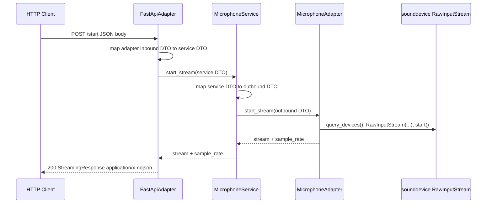
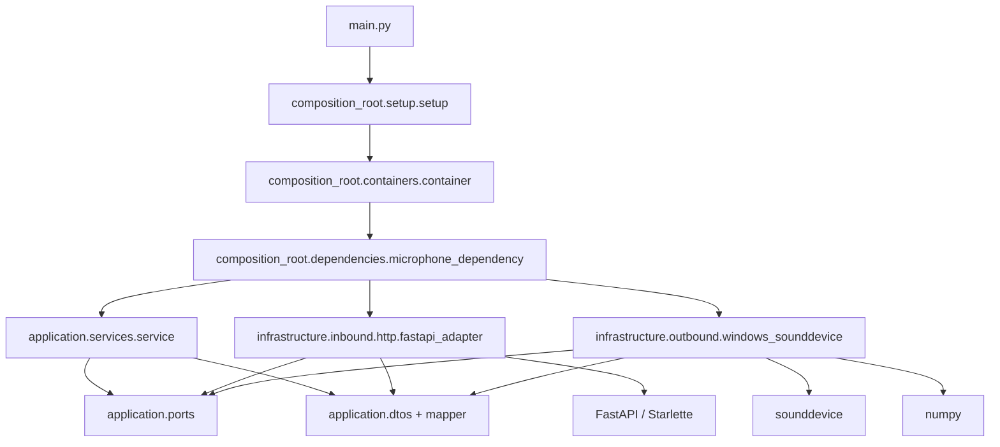

# Microphone Microservice

Technical knowledge-transfer README for the current `microphone_microservice` codebase.

This project is a Windows-oriented Python FastAPI microservice that exposes local microphone audio over HTTP streaming endpoints. Streaming responses use newline-delimited JSON events (`application/x-ndjson`) so clients can detect each logical audio output without waiting for the HTTP connection to close. The implementation uses a hexagonal, ports-and-adapters structure: HTTP is the inbound adapter, the application service is the framework-neutral core, and `sounddevice`/PortAudio is the outbound hardware adapter.

Status labels used in this document:

- **Observed**: directly supported by files in this repository.
- **Inferred**: derived from implementation behavior, naming, or common framework defaults.
- **Needs verification**: not fully proven by this repository, usually because runtime hardware, OS settings, or deployment configuration are required.

## Table of Contents

- [Project Overview](#project-overview)
- [Streaming Event Contract](#streaming-event-contract)
- [Architecture](#architecture)
- [Repository Structure](#repository-structure)
- [Runtime Flow](#runtime-flow)
- [Ports & Interfaces](#ports--interfaces)
- [Quick Port Reference](#quick-port-reference)
- [Data Model](#data-model)
- [Configuration](#configuration)
- [Build & Deployment](#build--deployment)
- [Dependencies](#dependencies)
- [State & Persistence](#state--persistence)
- [Failure & Recovery](#failure--recovery)
- [Security](#security)
- [Derived Project Transfer Notes](#derived-project-transfer-notes)
- [Unknowns / Technical Debt](#unknowns--technical-debt)

## Project Overview

### What the project actually does

The service starts an HTTP server on `127.0.0.1:8000` and exposes endpoints for:

- starting a microphone input stream;
- returning live audio as an event-based HTTP streaming response;
- returning the currently active stream;
- stopping the stream and releasing the underlying PortAudio device;
- reporting whether the adapter currently considers the microphone stream active;
- returning a basic service health response.

The audio adapter uses `sounddevice.RawInputStream` with `dtype="int16"`. Successful streaming responses return `application/x-ndjson` events. Audio bytes are base64-encoded in `payload.bytes_base64`. When the adapter opens a stereo device, `SoundDeviceAsyncStream` mixes the audio down to mono before yielding bytes to the HTTP event encoder.

## Streaming Event Contract

`POST /start` and `GET /stream` emit one complete JSON object per line using the `application/x-ndjson` media type. Every event has this shape:

```json
{"type":"partial","sequence":2,"timestamp":"2026-05-24T12:00:01Z","payload":{"bytes_base64":"cGNtLWJ5dGVz"}}
```

Required fields:

| Field | Type | Description |
|---|---|---|
| `type` | string | Event type. Clients should ignore unknown types but log them. |
| `sequence` | integer | Monotonically increasing event number, starting at `1` for each stream response. |
| `timestamp` | string | UTC ISO-8601 timestamp. |
| `payload` | object | Event-specific data. |

Supported event types:

| Type | Payload | Meaning |
|---|---|---|
| `stream_started` | `{}` | Emitted once when the HTTP stream begins. |
| `partial` | `{"bytes_base64":"..."}` | Audio bytes are being produced. |
| `completed` | `{"reason":"completed","output":"","bytes_base64":"..."}` | One logical audio output is complete. The HTTP connection may remain open and more outputs may follow. |
| `error` | `{"code":"audio_stream_failed","message":"Audio stream failed while producing events.","recoverable":true}` | The stream cannot continue normally. |

Each audio chunk from the microphone is treated as one logical output: the service emits a `partial` event with `bytes_base64`, then a `completed` event for that same chunk. This makes completion explicit even for long-lived microphone streams.

Protocol guarantees:

- the first emitted event is always `stream_started`;
- `sequence` starts at `1` and increases by exactly `1` for each event in one HTTP stream response;
- every `partial` audio output is followed by a `completed` event for that logical output;
- `completed` means the logical output is done, not that the HTTP connection is closing;
- binary audio is never written as raw response bytes and is always encoded as base64 in `payload.bytes_base64`;
- protocol state is carried in event fields, never as sentinel text such as `EOF`, `<END>`, or `[DONE]`.

Completion reasons currently emitted by this service:

| Reason | Meaning |
|---|---|
| `completed` | A microphone audio chunk has been fully emitted. |

Other consumers of this contract may also see `silence`, `end_of_input`, `limit_reached`, or `manual_stop` if future stream types are added.

Real example:

```json
{"type":"stream_started","sequence":1,"timestamp":"2026-05-24T12:00:00Z","payload":{}}
{"type":"partial","sequence":2,"timestamp":"2026-05-24T12:00:01Z","payload":{"bytes_base64":"cGNtLWJ5dGVz"}}
{"type":"completed","sequence":3,"timestamp":"2026-05-24T12:00:01Z","payload":{"reason":"completed","output":"","bytes_base64":"cGNtLWJ5dGVz"}}
{"type":"partial","sequence":4,"timestamp":"2026-05-24T12:00:02Z","payload":{"bytes_base64":"bmV4dC1jaHVuaw=="}}
{"type":"completed","sequence":5,"timestamp":"2026-05-24T12:00:02Z","payload":{"reason":"completed","output":"","bytes_base64":"bmV4dC1jaHVuaw=="}}
```

Client behavior:

- read one JSON line at a time;
- validate the four required fields;
- decode `payload.bytes_base64` for audio data;
- act immediately on `completed`;
- stop or retry when receiving `error`;
- never wait for connection close to decide that a logical output is complete.

Minimal Python client loop:

```python
import base64
import json

import httpx

with httpx.stream(
    "POST",
    "http://127.0.0.1:8000/start",
    json={"sample_rate": 16000, "channels": 1, "chunk_size": 1024},
    timeout=None,
) as response:
    response.raise_for_status()
    for line in response.iter_lines():
        event = json.loads(line)
        event_type = event["type"]
        payload = event["payload"]

        if event_type == "partial":
            audio_bytes = base64.b64decode(payload["bytes_base64"])
            # Buffer or play audio_bytes.
        elif event_type == "completed":
            # Process the completed logical output immediately.
            pass
        elif event_type == "error":
            raise RuntimeError(payload["message"])
```

### Main responsibilities

- Own the lifecycle of one local microphone input stream.
- Select a usable input device through `sounddevice.query_devices()`.
- Convert blocking `RawInputStream.read()` calls into an async iterator suitable for FastAPI `StreamingResponse`.
- Expose a small HTTP control plane for start, stop, health, availability, and stream retrieval.
- Keep concrete framework and hardware dependencies outside the application service by using adapter ports and DTO mappers.

### Core business logic

The domain behavior is intentionally thin. `application/services/service.py` delegates all hardware behavior to `AdapterOutboundPort`. Its core responsibility is preserving the application boundary:

1. Map inbound service DTOs to outbound adapter DTOs.
2. Call the outbound adapter.
3. Map outbound adapter DTOs back to service DTOs.

The concrete business rules currently live mostly in `infrastructure/outbound/windows_sounddevice.py`:

- reject non-positive `sample_rate`, `channels`, or `chunk_size`;
- reject a second `start_stream` while a stream is already active;
- scan input devices and optionally match configured `target_keywords`;
- fall back to the OS default input device when no keyword matches;
- retry opening the stream at the hardware default sample rate if the requested rate fails;
- retry mono failures as stereo and mix stereo to mono in the async byte iterator;
- treat `stop_stream` as idempotent when no stream is active.

### Main workflows and lifecycle

1. `python main.py` calls `asyncio.run(setup())`.
2. `composition_root.setup.setup()` builds the dependency graph with `BuildContainer()`.
3. The container constructs `MicrophoneAdapter`, `MicrophoneService`, `FastAPI`, and `FastApiAdapter`.
4. `FastApiAdapter` registers HTTP routes on the `FastAPI` application.
5. Uvicorn serves the app on `127.0.0.1:8000`.
6. Clients call `/start` to open and stream from the microphone.
7. Clients may call `/stream` to retrieve the active stream.
8. Clients call `/stop`, or process shutdown triggers `_cleanup()`, to close the stream.

## Architecture

### High-level architecture

Observed architecture: hexagonal architecture with explicit inbound and outbound ports.

```mermaid
flowchart LR
    Client["HTTP client"] --> FastAPIAdapter["FastApiAdapter\ninfrastructure/inbound/http"]
    FastAPIAdapter --> InboundMappers["adapter_inbound_to_service\nservice_to_adapter_inbound"]
    InboundMappers --> Service["MicrophoneService\napplication/services"]
    Service --> OutboundMappers["service_to_adapter_outbound\nadapter_outbound_to_service"]
    OutboundMappers --> SoundDeviceAdapter["MicrophoneAdapter\ninfrastructure/outbound"]
    SoundDeviceAdapter --> PortAudio["sounddevice / PortAudio"]
    PortAudio --> Hardware["Windows microphone input device"]
```



### Component relationships

- `main.py` owns only process entry and `KeyboardInterrupt` handling.
- `composition_root/setup/setup.py` owns Uvicorn startup and post-server cleanup.
- `composition_root/containers/container.py` owns top-level dependency assembly.
- `composition_root/dependencies/microphone_dependency.py` owns the concrete microphone dependency graph.
- `infrastructure/inbound/http/fastapi_adapter.py` owns HTTP routes and HTTP response formatting.
- `application/services/service.py` owns service-level orchestration across ports.
- `application/ports/*.py` define abstract contracts.
- `application/dtos/*.py` define immutable dataclass DTOs at each boundary.
- `application/dtos/mapper/*.py` map DTOs between boundaries.
- `infrastructure/outbound/windows_sounddevice.py` owns all hardware interaction.

### Internal modules and responsibilities

| Module | Responsibility |
|---|---|
| `application.ports.adapter_inbound_port` | Abstract contract for inbound adapters. Includes FastAPI app access and stream operations. |
| `application.ports.service_port` | Abstract contract implemented by the application service. |
| `application.ports.adapter_outbound_port` | Abstract contract for microphone hardware adapters. |
| `application.dtos.adapter_inbound_dtos` | DTOs used by the HTTP adapter boundary. |
| `application.dtos.services_dtos` | DTOs used by the service boundary. |
| `application.dtos.adapter_outbound_dtos` | DTOs used by the outbound adapter boundary, including `InitOutboundAdapterDto`. |
| `application.dtos.mapper.*` | Pure field-copy mapping functions between corresponding DTO types. |
| `application.services.service.MicrophoneService` | Orchestrates calls into the outbound port. |
| `infrastructure.inbound.http.fastapi_adapter.FastApiAdapter` | Registers FastAPI routes and converts service results into JSON or streaming HTTP responses. |
| `infrastructure.outbound.windows_sounddevice.MicrophoneAdapter` | Selects and opens microphone devices, streams PCM bytes, stops and cleans up hardware state. |
| `infrastructure.outbound.windows_sounddevice.SoundDeviceAsyncStream` | Async iterator wrapper around blocking `RawInputStream.read()`. |
| `composition_root.dependencies.microphone_dependency.generate_microphone_dependency` | Instantiates `MicrophoneAdapter`, `MicrophoneService`, `FastAPI`, and `FastApiAdapter`. |
| `composition_root.containers.container.BuildContainer` | Creates the top-level frozen `Container`. |
| `composition_root.setup.setup.setup` | Starts Uvicorn and invokes cleanup after shutdown. |

### Data flow between modules



### Dependency graph



Important coupling note: the intended architecture keeps `application/` framework-neutral, but `application/ports/adapter_inbound_port.py` imports `fastapi.FastAPI`. This is a current architectural leak.

## Repository Structure

```text
microphone_microservice/
├── .env
├── .env.production
├── .gitignore
├── .vscode/
│   ├── launch.json
│   └── settings.json
├── application/
│   ├── dtos/
│   │   ├── adapter_inbound_dtos.py
│   │   ├── adapter_outbound_dtos.py
│   │   ├── services_dtos.py
│   │   └── mapper/
│   ├── ports/
│   └── services/
├── composition_root/
│   ├── containers/
│   ├── dependencies/
│   └── setup/
├── docs/
│   └── general.md
├── infrastructure/
│   ├── inbound/http/
│   └── outbound/
├── main.py
├── requirements.windows.txt
├── tests/
│   └── simple.py
└── windows/
```

### Important folders and files

| Path | Purpose |
|---|---|
| `main.py` | Process entry point. Calls `asyncio.run(setup())`; catches `KeyboardInterrupt`. |
| `.env` | Development environment file containing `APP_ENV=development` and `LOG_LEVEL=TRACE`. |
| `.env.staging` | Staging environment file containing `APP_ENV=staging` and `LOG_LEVEL=WARN`. |
| `.env.production` | Production environment file containing `APP_ENV=production` and `LOG_LEVEL=CRITICAL`. |
| `requirements.windows.txt` | Declared dependencies: `fastapi`, `uvicorn`, `sounddevice`, `soundfile`, `numpy`, `pytest`. It omits `httpx`, although `tests/simple.py` imports it. |
| `.vscode/launch.json` | VS Code debug/run profiles using the checked-in `windows/Scripts/python.exe` interpreter and `.env` files. |
| `.vscode/settings.json` | VS Code interpreter path and terminal activation setting. |
| `application/` | Application contracts, DTOs, mappers, and service orchestration. |
| `composition_root/` | Concrete dependency wiring and runtime setup. |
| `infrastructure/inbound/http/fastapi_adapter.py` | HTTP adapter and route definitions. |
| `infrastructure/outbound/windows_sounddevice.py` | `sounddevice` microphone implementation. |
| `tests/simple.py` | Self-hosting end-to-end integration test that starts Uvicorn, calls endpoints, reads stream bytes, and stops the server. |
| `docs/general.md` | A generic architectural README template prompt, not current project documentation. |
| `windows/` | Checked-in Windows virtual environment. `.gitignore` ignores this path, but it exists in the current workspace. |

### Entry points

- Runtime entry point: `main.py`.
- Server setup entry point: `composition_root/setup/setup.py::setup`.
- E2E test entry point: `tests/simple.py`.
- HTTP API app source: `container.microphone_dependency.adapter_inbound.get_app`.

## Runtime Flow

### Startup sequence

1. User runs:

   ```powershell
   python main.py
   ```

2. `main.py` imports `setup` from `composition_root.setup.setup`.
3. `asyncio.run(setup())` creates a new asyncio event loop.
4. `setup()` prints startup banners and host/port.
5. `BuildContainer(name=NAME)` constructs the dependency graph.
6. `setup()` retrieves the FastAPI app through `container.microphone_dependency.adapter_inbound.get_app`.
7. `uvicorn.Config(app, host="127.0.0.1", port=8000)` is created.
8. `uvicorn.Server(config)` is created.
9. `await server.serve()` starts the blocking async Uvicorn lifecycle.

### Initialization process

Dependency construction happens in `generate_microphone_dependency()`:

1. Create `InitOutboundAdapterDto(default_fallback_rate=16000, target_keywords=[])`.
2. Create `MicrophoneAdapter(init_outbound_adapter_dto)`.
3. Create `MicrophoneService(name="Microphone", controller_port=adapter_outbound)`.
4. Create `FastAPI(title=name, description=..., version="1.0.0", docs_url="/docs", redoc_url="/redoc", openapi_url="/openapi.json")`.
5. Create `FastApiAdapter(service_port=service, app=app)`.
6. `FastApiAdapter.__init__()` calls `register_routes(app)`.
7. Return `MicrophoneDependency(adapter_inbound, adapter_outbound, service)`.

### Service registration

Routes are registered imperatively inside `FastApiAdapter.register_routes()` via nested handler functions:

- `POST /start`
- `POST /stop`
- `GET /available`
- `GET /stream`
- `GET /health`

FastAPI also exposes framework-generated documentation and schema endpoints:

- `GET /docs`
- `GET /redoc`
- `GET /openapi.json`

### Request lifecycle

For `/start`:

1. FastAPI deserializes the request body into `application.dtos.adapter_inbound_dtos.StartMicrophoneStreamRequestDto`.
2. `FastApiAdapter.start_stream()` maps inbound DTO to service DTO.
3. `MicrophoneService.start_stream()` maps service DTO to outbound DTO.
4. `MicrophoneAdapter.start_stream()` validates request values, selects a device, opens `sd.RawInputStream`, wraps it in `SoundDeviceAsyncStream`, and marks `started=True`.
5. Responses are mapped back through service and inbound adapter DTOs.
6. `FastApiAdapter` returns `StreamingResponse(event_stream_from_audio_bytes(response.stream), media_type="application/x-ndjson")`.

For `/stream`:

1. FastAPI creates `GetStreamRequestDto`.
2. The service delegates to `MicrophoneAdapter.mic_stream()`.
3. If a stream is active, the current async iterator is returned as `StreamingResponse`.
4. If no stream is active, the adapter raises `RuntimeError("Microphone stream is not active")`; the HTTP handler returns a 500 JSON error.

For `/stop`:

1. FastAPI deserializes `{}` into `StopMicrophoneStreamRequestDto`.
2. The service delegates to `MicrophoneAdapter.stop_stream()`.
3. If no stream is active, the adapter returns success immediately.
4. If active, it closes `SoundDeviceAsyncStream`, stops and closes `RawInputStream`, clears runtime state, and returns `success=True`.

### Shutdown behavior

Observed behavior:

- Uvicorn handles process termination while `server.serve()` is running.
- After `server.serve()` returns, `setup()` calls `_cleanup(container)`.
- `_cleanup()` checks whether the outbound adapter is a `MicrophoneAdapter`.
- If the adapter is still started, it calls `adapter.stop_stream(StopMicrophoneStreamRequestDto())`.
- Cleanup prints `Cleanup finished.`.

Needs verification:

- Shutdown behavior when a client disconnects from `/start` but does not call `/stop`. The streaming iterator stops when `RawInputStream.read()` raises, but the adapter's `started` flag is not cleared by `SoundDeviceAsyncStream.__anext__()` itself.
- Whether Uvicorn always gets to post-serve cleanup on all termination modes in the target Windows environment.

## Ports & Interfaces

### Interface inventory table

| Type | Port | Protocol | Path/Topic | Purpose | Handler | Dependencies |
|---|---:|---|---|---|---|---|
| HTTP inbound | `8000` | HTTP | `POST /start` | Start microphone and stream audio events | `FastApiAdapter.handle_start_stream` | `MicrophoneService`, `MicrophoneAdapter`, `sounddevice`, `numpy` |
| HTTP inbound | `8000` | HTTP | `POST /stop` | Stop active microphone stream | `FastApiAdapter.handle_stop_stream` | `MicrophoneService`, `MicrophoneAdapter`, `sounddevice` |
| HTTP inbound | `8000` | HTTP | `GET /available` | Return whether stream is active | `FastApiAdapter.handle_check_availability` | `MicrophoneService`, `MicrophoneAdapter` |
| HTTP inbound | `8000` | HTTP | `GET /stream` | Stream the already active microphone iterator | `FastApiAdapter.handle_get_stream` | `MicrophoneService`, `MicrophoneAdapter`, `sounddevice`, `numpy` |
| HTTP inbound | `8000` | HTTP | `GET /health` | Basic health response | `FastApiAdapter.health_check` | FastAPI only |
| HTTP inbound | `8000` | HTTP | `GET /docs` | Swagger UI generated by FastAPI | FastAPI | OpenAPI schema |
| HTTP inbound | `8000` | HTTP | `GET /redoc` | ReDoc generated by FastAPI | FastAPI | OpenAPI schema |
| HTTP inbound | `8000` | HTTP | `GET /openapi.json` | OpenAPI schema generated by FastAPI | FastAPI | Registered routes and DTO schemas |
| Hardware outbound | N/A | PortAudio / OS audio API | Default or selected input device | Capture microphone PCM frames | `MicrophoneAdapter` | `sounddevice`, PortAudio, Windows audio device |
| CLI/process | N/A | Local process | `python main.py` | Start production-like service | `main.py` | `composition_root.setup.setup` |
| CLI/process | N/A | Local process | `python tests/simple.py` | Run self-hosting E2E flow | `tests/simple.py` | `uvicorn`, `httpx`, live microphone |

No GraphQL, WebSocket, MQTT, serial, gRPC, message queue, webhook, cron, scheduled job, file watcher, or internal event bus implementation was found in the current repository.

### `POST /start`

| Field | Value |
|---|---|
| Port | `8000` |
| Protocol | HTTP |
| Path | `/start` |
| Purpose | Open a local microphone stream and return it immediately as NDJSON audio events. |
| Authentication | None. |
| Handler/module | `infrastructure/inbound/http/fastapi_adapter.py::handle_start_stream` |
| Internal service | `application/services/service.py::MicrophoneService.start_stream` |
| Outbound dependency | `infrastructure/outbound/windows_sounddevice.py::MicrophoneAdapter.start_stream` |
| Media type | `application/x-ndjson` on success. |
| Side effects | Opens a `sounddevice.RawInputStream`, starts the device stream, stores adapter state, writes telemetry to stdout. |
| Required environment variables | None in current code. |
| Timeout/retry behavior | No HTTP timeout configured in the service. Hardware open retries once with hardware default sample rate, then possibly retries mono as stereo. |

Request DTO:

```python
@dataclass(slots=True, frozen=True)
class StartMicrophoneStreamRequestDto:
    sample_rate: int = 16000
    channels: int = 1
    chunk_size: int = 1024
```

Example request:

```bash
curl -N -X POST http://127.0.0.1:8000/start \
  -H "Content-Type: application/json" \
  -d '{"sample_rate":16000,"channels":1,"chunk_size":1024}'
```

Example success response:

```http
HTTP/1.1 200 OK
content-type: application/x-ndjson
x-sample-rate: 16000
x-action: start_stream
x-status: success
x-message: Microphone stream started successfully
x-timestamp: 1779280000.123

{"type":"stream_started","sequence":1,"timestamp":"2026-05-24T12:00:00Z","payload":{}}
{"type":"partial","sequence":2,"timestamp":"2026-05-24T12:00:01Z","payload":{"bytes_base64":"cGNtLWJ5dGVz"}}
{"type":"completed","sequence":3,"timestamp":"2026-05-24T12:00:01Z","payload":{"reason":"completed","output":"","bytes_base64":"cGNtLWJ5dGVz"}}
```

Example failure response:

```json
{
  "action": "start_stream",
  "status": "error",
  "status_code": 500,
  "message": "Failed to start microphone stream: Microphone stream already started",
  "timestamp": 1779280000.123,
  "data": "Microphone stream already started"
}
```

Failure behavior:

- invalid non-positive parameters raise `ValueError` and return HTTP 500;
- starting while already active raises `RuntimeError` and returns HTTP 500;
- no microphone device raises `RuntimeError("No microphone devices available")` and returns HTTP 500;
- unsupported sample rate may recover by retrying with the hardware default;
- mono open failure may recover by opening stereo and downmixing chunks to mono.

### `POST /stop`

| Field | Value |
|---|---|
| Port | `8000` |
| Protocol | HTTP |
| Path | `/stop` |
| Purpose | Stop and close the active microphone stream. |
| Authentication | None. |
| Handler/module | `FastApiAdapter.handle_stop_stream` |
| Dependencies triggered | `MicrophoneService.stop_stream`, `MicrophoneAdapter.stop_stream`, `RawInputStream.stop()`, `RawInputStream.close()` |
| Side effects | Closes stream wrapper, stops and closes PortAudio stream, clears adapter state. |
| Required environment variables | None. |
| Timeout/retry behavior | No explicit timeout or retry. |

Example request:

```bash
curl -X POST http://127.0.0.1:8000/stop \
  -H "Content-Type: application/json" \
  -d '{}'
```

Example success response:

```json
{
  "action": "stop_stream",
  "status": "success",
  "status_code": 200,
  "message": "Microphone stream stopped successfully",
  "timestamp": 1779280000.123,
  "data": true
}
```

Failure behavior:

- if no stream is active, the adapter returns success;
- exceptions during close are wrapped as `RuntimeError("Failed to stop microphone stream: ...")` and returned as HTTP 500.

### `GET /available`

| Field | Value |
|---|---|
| Port | `8000` |
| Protocol | HTTP |
| Path | `/available` |
| Purpose | Return the adapter's current `started` flag. |
| Authentication | None. |
| Handler/module | `FastApiAdapter.handle_check_availability` |
| Dependencies triggered | `MicrophoneService.is_available`, `MicrophoneAdapter.is_available` |
| Side effects | None. |
| Required environment variables | None. |
| Timeout/retry behavior | None. |

Example request:

```bash
curl http://127.0.0.1:8000/available
```

Example success response:

```json
{
  "action": "check_availability",
  "status": "success",
  "status_code": 200,
  "message": "Microphone availability checked successfully",
  "timestamp": 1779280000.123,
  "data": false
}
```

Important semantic note: this endpoint reports whether the microservice has an active stream, not whether the OS has any physical microphone available. The name `available` is misleading for hardware discovery.

### `GET /stream`

| Field | Value |
|---|---|
| Port | `8000` |
| Protocol | HTTP |
| Path | `/stream` |
| Purpose | Return the existing active microphone stream as NDJSON audio events. |
| Authentication | None. |
| Handler/module | `FastApiAdapter.handle_get_stream` |
| Dependencies triggered | `MicrophoneService.mic_stream`, `MicrophoneAdapter.mic_stream`, existing `SoundDeviceAsyncStream` |
| Side effects | Reads from the same underlying stream iterator; writes telemetry to stdout while chunks are read. |
| Required environment variables | None. |
| Timeout/retry behavior | No explicit timeout or retry. |

Example request:

```bash
curl -N http://127.0.0.1:8000/stream
```

Example success response:

```http
HTTP/1.1 200 OK
content-type: application/x-ndjson
x-sample-rate: 16000
x-action: get_stream
x-status: success
x-message: Microphone stream retrieved successfully
x-timestamp: 1779280000.123

{"type":"stream_started","sequence":1,"timestamp":"2026-05-24T12:00:00Z","payload":{}}
{"type":"partial","sequence":2,"timestamp":"2026-05-24T12:00:01Z","payload":{"bytes_base64":"cGNtLWJ5dGVz"}}
{"type":"completed","sequence":3,"timestamp":"2026-05-24T12:00:01Z","payload":{"reason":"completed","output":"","bytes_base64":"cGNtLWJ5dGVz"}}
```

Failure behavior:

- if no stream has been started, returns HTTP 500 JSON with `data` containing `Microphone stream is not active`;
- concurrent reads from `/start` and `/stream` share one async iterator and underlying device stream. Needs verification for multi-client behavior.

### `GET /health`

| Field | Value |
|---|---|
| Port | `8000` |
| Protocol | HTTP |
| Path | `/health` |
| Purpose | Basic process health response. |
| Authentication | None. |
| Handler/module | `FastApiAdapter.health_check` |
| Dependencies triggered | None beyond FastAPI response creation. |
| Side effects | None. |
| Required environment variables | None. |
| Timeout/retry behavior | None. |

Example request:

```bash
curl http://127.0.0.1:8000/health
```

Example response:

```json
{
  "action": "health_check",
  "status": "success",
  "status_code": 200,
  "message": "Service is healthy",
  "timestamp": 1779280000.123,
  "data": null
}
```

### FastAPI generated interfaces

The app is instantiated with:

- `docs_url="/docs"`
- `redoc_url="/redoc"`
- `openapi_url="/openapi.json"`

These interfaces are unauthenticated and available on the same host and port. They expose schema information for all registered routes.

### Outbound integrations

#### Windows audio input device through `sounddevice`

| Field | Value |
|---|---|
| Purpose | Capture microphone input as raw signed 16-bit PCM frames. |
| How it is used | `sd.query_devices()` scans devices; `sd.RawInputStream(...)` opens the selected input device; `.read(chunk_size)` retrieves chunks. |
| Authentication | OS-level device permissions only. No app-level auth. |
| Retry behavior | Retry with hardware default sample rate; retry mono as stereo if mono fails. |
| Failure modes | No input devices, no OS default device, unsupported sample rate, unsupported channel count, PortAudio open/read failure, device already in use. |
| Required configs | `default_fallback_rate` and `target_keywords` are passed through `InitOutboundAdapterDto`; currently hardcoded as `16000` and `[]`. |

#### Python package/runtime dependencies

The service depends on installed Python packages and native PortAudio binaries supplied by `sounddevice`. In the current workspace, the checked-in `windows` environment includes PortAudio DLLs under `windows/Lib/site-packages/_sounddevice_data/portaudio-binaries/`.

## Quick Port Reference

For rebuilding or integrating the system, preserve this control surface first:

| Operation | Method | URL | Request | Success response | Notes |
|---|---|---|---|---|---|
| Health | `GET` | `http://127.0.0.1:8000/health` | none | JSON envelope with `data: null` | Does not verify microphone hardware. |
| Start stream | `POST` | `http://127.0.0.1:8000/start` | `{"sample_rate":16000,"channels":1,"chunk_size":1024}` | `application/x-ndjson` streaming audio events | Opens hardware and sets active state. |
| Get active stream | `GET` | `http://127.0.0.1:8000/stream` | none | `application/x-ndjson` streaming audio events | Requires prior `/start`. |
| Stop stream | `POST` | `http://127.0.0.1:8000/stop` | `{}` | JSON envelope with `data: true` | Idempotent when inactive. |
| Active flag | `GET` | `http://127.0.0.1:8000/available` | none | JSON envelope with boolean `data` | Reports active stream state, not physical availability. |

Default runtime:

- Host: `127.0.0.1`
- Port: `8000`
- Audio format: signed 16-bit PCM bytes encoded as base64 in event payloads
- Default sample rate: `16000`
- Default channels requested: `1`
- Default chunk size: `1024` frames
- Success streaming media type: `application/x-ndjson`
- Authentication: none

## Data Model

### Key entities

This project has no database entities. Its data model consists of immutable DTOs and in-memory adapter state.

### DTO schemas

All DTOs are `@dataclass(slots=True, frozen=True)`.

#### StartMicrophoneStreamRequestDto

Used in inbound, service, and outbound DTO modules with the same fields.

| Field | Type | Default | Meaning |
|---|---|---:|---|
| `sample_rate` | `int` | `16000` | Requested sample rate in Hz. |
| `channels` | `int` | `1` | Requested input channel count. |
| `chunk_size` | `int` | `1024` | Frames per `RawInputStream.read()` call. |

#### StartMicrophoneStreamResponseDto

| Field | Type | Meaning |
|---|---|---|
| `stream` | `AsyncIterator[bytes]` | Async byte stream returned to FastAPI. |
| `sample_rate` | `int` | Actual sample rate used after fallback logic. |

#### StopMicrophoneStreamRequestDto

Empty dataclass. FastAPI accepts `{}` as the JSON body for `POST /stop`.

#### StopMicrophoneStreamResponseDto

| Field | Type | Default | Meaning |
|---|---|---:|---|
| `success` | `bool` | `True` | Stop operation outcome. |

#### MicrophoneAvailabilityRequestDto

Empty dataclass. Constructed internally for `GET /available`.

#### MicrophoneAvailabilityResponseDto

| Field | Type | Meaning |
|---|---|---|
| `is_available` | `bool` | Current value of `MicrophoneAdapter.started`. |

#### GetStreamRequestDto

Empty dataclass. Constructed internally for `GET /stream`.

#### GetStreamResponseDto

| Field | Type | Meaning |
|---|---|---|
| `stream` | `AsyncIterator[bytes]` | Active stream iterator. |
| `sample_rate` | `int` | Active sample rate, or fallback rate if unset. |

#### InitOutboundAdapterDto

Only present in `application/dtos/adapter_outbound_dtos.py`.

| Field | Type | Default | Meaning |
|---|---|---:|---|
| `default_fallback_rate` | `int` | `16000` | Used when device metadata lacks `default_samplerate`, and as fallback sample rate. |
| `target_keywords` | `list[str]` | `[]` | Optional case-insensitive keywords for choosing a microphone by device name. |

### Runtime state

`MicrophoneAdapter` stores mutable runtime state as instance/class attributes:

| Attribute | Meaning |
|---|---|
| `started` | Whether the adapter believes a stream is active. |
| `mic_sample_rate` | Active sample rate. |
| `mic_chunk_size` | Active chunk size. |
| `mic_channels` | Active channel count; may become `2` after mono fallback. |
| `device_index` | Selected `sounddevice` device index. |
| `audio_stream` | Active `sd.RawInputStream`. |
| `loop_stream` | Active `SoundDeviceAsyncStream` wrapper. |
| `_mic_stream` | Active `AsyncIterator[bytes]` exposed to service and HTTP layer. |

Important: several of these attributes are declared at class level and mutated through the instance. With one adapter instance this works, but it is a hidden coupling risk if multiple adapters are created.

### Database structure

No database, migrations, ORM models, or persistent schemas were found.

### Relationships

- Inbound DTOs map to service DTOs.
- Service DTOs map to outbound DTOs.
- Outbound adapter returns stream DTOs.
- The same `SoundDeviceAsyncStream` object can be exposed through `/start` and `/stream`.

### Caching strategy

No cache layer exists. The only retained state is the active microphone stream and associated parameters in memory.

## Configuration

### Environment variables

`.vscode/launch.json` is the source of truth for runtime environment selection. The real entry point is `main.py`, which calls `composition_root.setup.setup()` to build the FastAPI dependency graph and start Uvicorn on `127.0.0.1:8000`.

`composition_root/runtime/environment.py` resolves the application environment from VS Code launch profile configuration and the runtime process environment. Supported values are `development`, `staging`, and `production`. Missing or invalid values fall back to `development`.

Resolution precedence is:

1. Process environment: `APP_ENV`, then `VSCODE_ENV`.
2. Selected VS Code launch profile `env`: `APP_ENV`, then `VSCODE_ENV`.
3. Selected VS Code launch profile `envFile`: `APP_ENV`, then `VSCODE_ENV`.
4. Safe default: `development`.

The selected launch profile is identified by `VSCODE_LAUNCH_PROFILE` when present. If it is missing, the resolver matches a launch profile with the same environment value, then falls back to the first launch profile.

| Variable | Required | Default | Purpose | Example |
|---|---|---|---|---|
| `APP_ENV` | No | `development` | Primary application environment value used by the runtime resolver. | `development`, `staging`, `production` |
| `VSCODE_ENV` | No | `development` | Secondary application environment value if `APP_ENV` is absent. | `development` |
| `VSCODE_LAUNCH_PROFILE` | No | First matching profile | Names the active VS Code launch profile for fallback resolution. | `Python: Run (development env)` |
| `LOG_LEVEL` | No | Environment-derived | Present in env files for operator clarity; the custom logger filters by `APP_ENV`. | `TRACE`, `WARN`, `CRITICAL` |

Inferred desirable future variables:

| Variable | Required | Default | Purpose | Example |
|---|---|---|---|---|
| `SERVICE_HOST` | No | `127.0.0.1` | Make Uvicorn bind host configurable. | `0.0.0.0` |
| `SERVICE_PORT` | No | `8000` | Make Uvicorn port configurable. | `8000` |
| `MIC_DEFAULT_FALLBACK_RATE` | No | `16000` | Configure `InitOutboundAdapterDto.default_fallback_rate`. | `48000` |
| `MIC_TARGET_KEYWORDS` | No | `[]` | Prefer microphone devices whose names contain configured keywords. | `USB,Microphone` |

### Config files

| File | Purpose | Runtime effect |
|---|---|---|
| `.env` | Development values: `APP_ENV=development`, `LOG_LEVEL=TRACE`. | Used by the development VS Code profile. |
| `.env.staging` | Staging values: `APP_ENV=staging`, `LOG_LEVEL=WARN`. | Used by the staging VS Code profile. |
| `.env.production` | Production values: `APP_ENV=production`, `LOG_LEVEL=CRITICAL`. | Used by the production VS Code profile. |
| `.vscode/launch.json` | Defines development, staging, and production launch configs. | Sets interpreter, `APP_ENV`, `VSCODE_LAUNCH_PROFILE`, and env file for VS Code. |
| `.vscode/settings.json` | Points VS Code to `windows/Scripts/python.exe`. | Editor/runtime convenience. |
| `requirements.windows.txt` | Declares install dependencies. | Used manually with `pip install -r`. |

### Secrets required

None. The current service has no API keys, database credentials, tokens, certificates, or other secrets.

### Mandatory vs optional settings

No mandatory environment variables exist in current code. A working microphone device and a Python environment with native audio dependencies are mandatory runtime prerequisites.

### Launch profile environment mapping

| VS Code profile | Environment |
|---|---|
| `Python: Run (development env)` | `development` |
| `Python: Run (staging env)` | `staging` |
| `Python: Run (production env)` | `production` |

To add a new launch profile, copy an existing profile in `.vscode/launch.json`, set `APP_ENV` to one of the supported environment values, set `VSCODE_LAUNCH_PROFILE` to the profile name, and point `envFile` to the matching `.env*` file. Adding a new environment value requires updating `SUPPORTED_ENVIRONMENTS` and `ENVIRONMENT_MIN_LEVEL`.

### Application logging

`composition_root/runtime/logger.py` is the centralized logger for project logs. Each log line includes a UTC timestamp, resolved environment, log level, module/scope name, message, and optional context fields.

| Environment | Custom application logs shown |
|---|---|
| `development` | `trace`, `info`, `warn`, `error`, `critical` |
| `staging` | `warn`, `error`, `critical` |
| `production` | `critical` only |

FastAPI and Uvicorn logging is not filtered by the custom application logger. Uvicorn request logs, startup logs, shutdown logs, and server errors remain visible in `development`, `staging`, and `production`.

## Build & Deployment

### Run locally

Windows PowerShell:

```powershell
python -m venv windows
.\windows\Scripts\Activate.ps1
python -m pip install -r requirements.windows.txt
python main.py
```

If using the checked-in local environment from this workspace, VS Code is configured to use:

```text
${workspaceFolder}/windows/Scripts/python.exe
```

### Run the E2E test

```powershell
python tests/simple.py
```

`tests/simple.py` is self-hosting:

1. builds the same container pattern as `main.py`;
2. starts Uvicorn on `127.0.0.1:8000`;
3. waits up to `10` seconds for `/health`;
4. calls `/health`, `/available`, `/start`, `/available`, `/stream`, `/stop`, `/available`;
5. reads streaming endpoints for `2` seconds each;
6. sets `server.should_exit = True` and waits for shutdown.

Needs verification: `requirements.windows.txt` does not declare `httpx`, although the test requires it. The current checked-in `windows` environment contains `httpx-0.28.1`.

### Build

No package build configuration exists. There is no `pyproject.toml`, `setup.cfg`, `setup.py`, or wheel/sdist process in the repository.

### Docker usage

No `Dockerfile` or Compose file was found. Production deployment is therefore currently process-based, not containerized.

### CI/CD behavior

No CI/CD configuration was found. There is no `.github/workflows`, Azure Pipelines YAML, GitLab CI, or similar pipeline file in the current repository.

### Production deployment process

Observed production behavior is limited to the VS Code profile named `Python: Run (production env)`, which:

- runs `main.py`;
- sets `APP_ENV=production`;
- loads `.env.production`;
- uses the local Windows virtual environment.

Needs verification:

- whether this service is intended to run as a Windows service, scheduled task, interactive process, or child process of another AI agent;
- whether host should remain loopback-only in production;
- how microphone permissions are granted in the target environment;
- whether stream clients are local-only or cross-process on the same machine.

### Infrastructure assumptions

- Windows host or a host compatible with the current `windows_sounddevice.py` adapter.
- Available input audio device.
- Port `8000` free on `127.0.0.1`.
- PortAudio usable through `sounddevice`.
- Client can consume indefinite streaming HTTP responses.

## Dependencies

### Declared dependencies

`requirements.windows.txt` declares:

| Dependency | Why it is used |
|---|---|
| `fastapi` | HTTP framework and request/response routing. |
| `uvicorn` | ASGI server. |
| `sounddevice` | PortAudio bindings for microphone capture. |
| `soundfile` | Declared audio dependency; not imported by current project source. |
| `numpy` | Stereo-to-mono conversion and telemetry calculations. |
| `pytest` | Declared test framework; current test file is executable directly and does not define pytest test functions. |

### Observed installed versions in `windows/Lib/site-packages`

The local checked-in environment contains at least:

| Package | Version |
|---|---:|
| `fastapi` | `0.136.1` |
| `uvicorn` | `0.47.0` |
| `starlette` | `1.0.0` |
| `pydantic` | `2.13.4` |
| `sounddevice` | `0.5.5` |
| `soundfile` | `0.13.1` |
| `numpy` | `2.4.5` |
| `pytest` | `9.0.3` |
| `httpx` | `0.28.1` |

Needs verification: the local Python executable in `windows/Scripts/python.exe` could not be executed from the current sandbox due to access denial, so versions above are read from `*.dist-info` directory names rather than `pip freeze`.

### Critical version constraints

No explicit pinned versions exist. For reproducibility, pin versions in `requirements.windows.txt` or add a lockfile.

Risk areas:

- FastAPI/Starlette/Pydantic compatibility can shift because no versions are pinned.
- `sounddevice` depends on native PortAudio behavior and device drivers.
- Python appears to be CPython 3.14 in the checked-in `__pycache__` and venv names (`cpython-314`), which may be newer than many third-party packages officially support. Needs verification.

## State & Persistence

### Databases

None.

### File storage

None used by application runtime.

### Cache

None.

### Session management

None. There are no user sessions, cookies, tokens, or client identities.

### Persistent runtime state

Runtime state is in memory only and is lost on process exit:

- active microphone stream;
- selected device index;
- actual sample rate;
- chunk size;
- channel count;
- stream telemetry counters.

`SoundDeviceAsyncStream` tracks:

- `_chunk_count`;
- `_total_bytes`;
- `_overflow_count`;
- `_closed`.

These counters are printed to stdout and are not persisted.

## Failure & Recovery

### Known failure points

| Area | Failure | Current behavior |
|---|---|---|
| Parameter validation | `sample_rate <= 0`, `channels <= 0`, `chunk_size <= 0` | Raises `ValueError`; HTTP 500 JSON. |
| Double start | `/start` called while `started=True` | Raises `RuntimeError`; HTTP 500 JSON. |
| Device discovery | No matching or default input device | Raises `RuntimeError("No microphone devices available")`; HTTP 500 JSON. |
| Sample rate | Requested rate unsupported | Retries with hardware default rate. |
| Channel count | Mono unsupported | Retries stereo if originally mono. |
| Stream read | `RawInputStream.read()` raises | `SoundDeviceAsyncStream` marks itself closed and raises an error so the HTTP event encoder can emit an `error` event. |
| Stop | `RawInputStream.stop()` or `.close()` raises | Raises wrapped `RuntimeError`; HTTP 500 JSON. |
| No active stream | `/stream` before `/start` | Raises `RuntimeError`; HTTP 500 JSON. |
| Port conflict | `127.0.0.1:8000` already used | Uvicorn startup fails. No custom recovery. |

### Retry logic

Only outbound hardware start has retry behavior:

1. Try requested `sample_rate`, `chunk_size`, `channels`.
2. On failure, set `mic_sample_rate` to the device default and retry.
3. If that retry fails and `mic_channels == 1`, set channels to `2` and retry.
4. If stereo retry fails or the request already used non-mono channels, propagate the exception.

No HTTP client retry, exponential backoff, queue retry, or background recovery loop exists.

### Error handling strategy

HTTP route handlers catch broad `Exception` and return JSON envelopes with HTTP 500. There is no specialized 400 response for invalid client input, no global exception handler, and no structured logging.

Streaming errors inside `SoundDeviceAsyncStream.__anext__()` are propagated to the HTTP event encoder, which emits an `error` event with a stable machine-readable code and recoverability flag.

### Recovery mechanisms

- `POST /stop` is idempotent when inactive.
- Process shutdown attempts to stop an active stream after Uvicorn exits.
- Restarting the process clears all in-memory state.

Needs verification:

- behavior when a streaming client disconnects without calling `/stop`;
- behavior under multiple simultaneous clients;
- behavior when the OS default microphone changes while the service is running.

## Security

### Authentication

None. Every endpoint is unauthenticated.

### Authorization

None. Any client that can reach `127.0.0.1:8000` can start, stop, and read microphone audio.

### Secrets handling

No secrets are used. `.env` files contain non-secret runtime labels only.

### Sensitive flows

The sensitive flow is microphone capture. `/start` and `/stream` expose live microphone audio as base64-encoded bytes inside NDJSON events.

### Exposed attack surface

| Surface | Risk |
|---|---|
| `POST /start` | Any local client can activate microphone capture. |
| `GET /stream` | Any local client can read active microphone audio. |
| `POST /stop` | Any local client can stop capture. |
| `/docs`, `/redoc`, `/openapi.json` | Exposes API shape to any local client. |
| Broad exception responses | Returns exception strings in `data`, potentially leaking internal state. |

Host binding is currently `127.0.0.1`, which limits network exposure to local clients. If changed to `0.0.0.0`, authentication and transport security become mandatory.

Recommended hardening for derived projects:

- keep loopback binding unless remote access is explicitly required;
- add an API token or mTLS before exposing beyond localhost;
- disable `/docs` and `/redoc` in production if not needed;
- return 400 for invalid request parameters rather than 500;
- avoid returning raw exception strings to clients;
- add explicit microphone consent and audit logging if used in user-facing systems.

## Derived Project Transfer Notes

### Reusable parts

- The composition-root pattern is reusable: construct outbound adapter, inject into service, construct FastAPI, inject service into inbound adapter.
- The DTO mapping pattern is reusable where strict boundary contracts matter.
- `MicrophoneService` is reusable if the outbound port contract remains the same.
- `FastApiAdapter` is reusable for HTTP streaming of `AsyncIterator[bytes]`.
- `tests/simple.py` is reusable as a model for self-hosting integration tests.

### Tightly coupled parts

- `MicrophoneAdapter` is tightly coupled to `sounddevice`, PortAudio behavior, and local OS audio devices.
- `setup()` is tightly coupled to `127.0.0.1:8000`.
- `BuildContainer()` is tightly coupled to `default_fallback_rate=16000` and empty `target_keywords`.
- The current inbound port imports `fastapi.FastAPI`, coupling the application port layer to FastAPI.
- `FastApiAdapter` is tightly coupled to JSON envelope shape and streaming response headers.

### Assumptions that exist

- Only one microphone stream is active per process.
- One adapter instance owns all stream state.
- Audio samples are signed 16-bit PCM.
- The service is mainly for localhost use.
- Clients can handle indefinite streaming responses.
- A stream should be explicitly stopped through `/stop` or process cleanup.
- Empty dataclass request bodies are acceptable for endpoints that do not need user input.

### What must be preserved for compatibility

- Endpoint paths and methods:
  - `POST /start`
  - `POST /stop`
  - `GET /available`
  - `GET /stream`
  - `GET /health`
- `/start` request fields and defaults:
  - `sample_rate=16000`
  - `channels=1`
  - `chunk_size=1024`
- Streaming response media type: `application/x-ndjson`.
- Streaming audio format: signed 16-bit PCM bytes encoded in `payload.bytes_base64`.
- Response headers expected by existing clients:
  - `X-Sample-Rate`
  - `X-Action`
  - `X-Status`
  - `X-Message` or current lowercase typo `X-message` on `/start`
  - `X-Timestamp`
- JSON response envelope fields:
  - `action`
  - `status`
  - `status_code`
  - `message`
  - `timestamp`
  - `data`

### Recommended extension points

- Add configuration parsing in `composition_root/dependencies/microphone_dependency.py` or `composition_root/setup/setup.py`, then pass values through DTOs.
- Add alternative outbound adapters implementing `AdapterOutboundPort`, such as:
  - fake microphone for tests;
  - file-backed PCM stream;
  - remote microphone over gRPC or WebSocket;
  - Linux PulseAudio/PipeWire-specific adapter.
- Add an inbound adapter for WebSocket streaming if clients need bidirectional control or easier browser integration.
- Add health checks that distinguish process health from microphone hardware availability.

### Safe refactoring boundaries

- Mappers can be consolidated or generated if DTO fields remain compatible.
- `MicrophoneAdapter` can move hardware selection into a helper class without changing ports.
- Uvicorn host/port can become env-driven if defaults remain `127.0.0.1:8000`.
- Telemetry output can be replaced with structured logging if stream bytes and DTOs remain unchanged.
- Tests can be split into pytest tests while preserving the self-hosting flow.

### Hidden coupling or implicit behavior

- `GET /available` means "stream active", not "physical microphone available".
- `/start` both starts the stream and consumes it as a streaming response. A client that disconnects early may leave service state active.
- `/stream` returns the same active async iterator rather than creating an independent stream reader.
- Broad exception handling makes many distinct failure modes look like HTTP 500.
- `target_keywords=[]` means device selection falls through to the OS default input device.
- Class-level mutable state declarations in `MicrophoneAdapter` may surprise future multi-instance use.
- `requirements.windows.txt` does not list all observed runtime/test imports.

### If rebuilding this project from scratch, here is what matters most

1. Preserve the external HTTP contract first: paths, methods, payload shape, JSON envelope, streaming response, and `X-Sample-Rate`.
2. Preserve the one-stream lifecycle: inactive -> `/start` opens hardware -> stream active -> `/stream` reads active stream -> `/stop` closes hardware.
3. Preserve signed 16-bit PCM byte output or explicitly version the API.
4. Keep hardware concerns behind an outbound port so tests and derived projects can replace `sounddevice`.
5. Make host, port, device selection, fallback sample rate, and auth configurable early.
6. Add a fake outbound adapter before expanding features; live microphone E2E tests are valuable but brittle in CI.

## Unknowns / Technical Debt

### Ambiguous behavior

- Whether `/start` should continue holding the stream after the starting client disconnects.
- Whether `/stream` is intended to support multiple concurrent consumers.
- Whether `/available` should mean physical device availability or active stream state.
- Whether `.env` files are intended to control runtime outside VS Code.
- Whether Python 3.14 is an intended target or only an artifact of the local venv.

### Missing documentation or config

- No existing `README.md` was present before this file.
- No `.env.example`.
- No pinned dependency versions.
- No `pyproject.toml`.
- No Docker files.
- No CI/CD config.
- No formal API contract tests.
- No unit tests for mappers, service orchestration, or hardware fallback logic.
- No fake microphone adapter for deterministic tests.

### Risk areas

- Live microphone tests require hardware and may fail in CI or headless environments.
- Broad HTTP 500 error handling hides client vs server error boundaries.
- The application layer imports FastAPI in `adapter_inbound_port.py`, weakening portability.
- `target_keywords: list[str] = []` in `generate_microphone_dependency()` uses a mutable default argument.
- `MicrophoneAdapter` declares mutable state at class level.
- The adapter prints telemetry directly to stdout, including non-ASCII characters that appear mojibake-corrupted in some files.
- No authentication protects microphone access.
- No graceful handling for port conflicts.
- No explicit cleanup hook is connected to FastAPI lifespan; cleanup happens after Uvicorn returns in `setup()`.

### Assumptions found in code

- Default bind address is `127.0.0.1`.
- Default port is `8000`.
- Default fallback sample rate is `16000`.
- Default requested channels is mono.
- Default chunk size is `1024`.
- Device default sample rate should be trusted if the requested rate fails.
- Stereo can be downmixed to mono by averaging `int16` samples per frame.
- Stopping when inactive should still return success.
